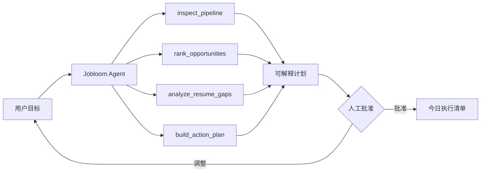

# Jobloom Agent

一个本地优先、可解释、会调用工具的求职 Agent。它会读取申请漏斗，分析简历与职位的匹配度，排列机会优先级，并生成需要人工批准的行动计划。

**在线体验：** [jobloom-career.kangkangnbb.chatgpt.site](https://jobloom-career.kangkangnbb.chatgpt.site)

[](https://github.com/kangkanga1/jobloom-agent/actions/workflows/bootstrap.yml)
[](LICENSE)
[](https://www.typescriptlang.org/)

## 为什么做这个项目

普通求职工具只负责记录信息，Jobloom Agent 进一步回答三个问题：

- 今天最值得推进哪几个机会？
- 简历和目标职位之间缺少哪些真实证据？
- 下一步应该做什么，并且为什么？

项目无需 API Key 即可完整运行。内置的确定性 Agent 会调用 4 个本地工具，输出可复现的决策依据；后续也可以把规划器替换成任意 LLM。

## 核心功能

- **Agent 控制台**：输入目标，自动检查工作区并生成优先级计划。
- **可解释工具轨迹**：展示调用了什么工具、输入了什么上下文、得到了什么结果，不展示隐藏推理。
- **Human-in-the-loop**：Agent 只提出行动，用户批准后才进入执行计划。
- **简历匹配**：本地比较简历与职位描述，提取已覆盖能力、缺口和优化建议。
- **申请看板**：管理收藏、已申请、面试中和 Offer 四个阶段，支持搜索、推进和 CSV 导出。
- **面试训练**：围绕真实职位生成结构化问题，自动保存回答和练习进度。
- **求职分析**：展示申请节奏、阶段漏斗、回复率和机会质量排行。
- **本地持久化**：简历、申请、回答和 Agent 记录都保存在浏览器 `localStorage` 中。
- **WebMCP**：页面向支持该标准的浏览器暴露结构化工具，可由外部 Agent 直接调用。

## Agent 工作流



### 内置 Agent 工具

| 工具 | 作用 | 是否修改数据 |
| --- | --- | --- |
| `inspect_pipeline` | 汇总申请阶段、截止日期和停滞机会 | 否 |
| `rank_opportunities` | 按阶段价值、匹配度和紧迫性排序 | 否 |
| `analyze_resume_gaps` | 复用最近一次简历匹配结果 | 否 |
| `build_action_plan` | 把判断转换为待批准任务 | 否 |

WebMCP 另外暴露 `run_job_search_agent`、`create_job_application`、`move_job_application` 和 `analyze_resume_match` 四个页面级工具。

## 快速开始

环境要求：Node.js `>= 22.13.0`、pnpm `11.x`。

```bash
git clone https://github.com/kangkanga1/jobloom-agent.git
cd jobloom-agent
pnpm install
pnpm dev
```

浏览器打开 `http://localhost:3000`。

### 常用命令

```bash
pnpm dev        # 本地开发
pnpm lint       # 检查应用源码
pnpm typecheck  # TypeScript 类型检查
pnpm check      # lint + typecheck
pnpm build      # 生产构建
```

## 技术栈

- React 19 + TypeScript
- Vinext / Vite
- Tailwind CSS 4
- shadcn primitives + Base UI
- Cloudflare Workers 兼容构建
- WebMCP imperative tools

## 项目结构

```text
app/
  page.tsx          # 完整产品界面、状态与 WebMCP 注册
  globals.css       # 视觉系统与全局样式
lib/
  agent.ts          # Agent 编排、工具轨迹和任务生成
  jobloom.ts        # 数据模型、匹配算法、面试问题与 CSV 导出
docs/
  architecture.md   # Agent 架构和扩展说明
```

## 数据与隐私

- 默认不发送任何网络请求，也不上传简历。
- 业务数据只保存在当前浏览器中，清理站点数据会删除本地记录。
- CSV 导出由浏览器直接生成。
- 演示职位和薪资仅用于界面示例，不代表真实招聘信息。

## 扩展 Agent

`lib/agent.ts` 中的规划器是纯函数：输入目标、职位列表和匹配结果，输出工具调用轨迹与行动计划。要接入 LLM，可以保留现有工具契约，只替换规划策略，并在服务端保存供应商密钥。详细设计见 [架构文档](docs/architecture.md)。

## 参与贡献

欢迎提交 Issue 或 Pull Request。开始前请阅读 [CONTRIBUTING.md](CONTRIBUTING.md)。

## English

Jobloom Agent is a local-first, tool-using career agent. It audits your application pipeline, ranks opportunities, reuses resume-gap analysis, and produces an explainable action plan that requires human approval. It works without an API key and keeps personal data in the browser by default.

## License

[MIT](LICENSE)
